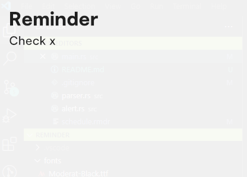

# Reminder

This program can be set to run on computer startup. 
It reads the file "schedule.rmdr", the file format for Reminders is documented in there.
When a reminder activates, a small window is opened with the reminder text. It closes upon clicking on it.
By default, window appearance adaptes to the time of day (light and dark theme).

These are the Themes:

    
    

The software is written by me in rust, using the crates `winit` and `wgpu` for the windows and `wgpu_text` for the text rendering.